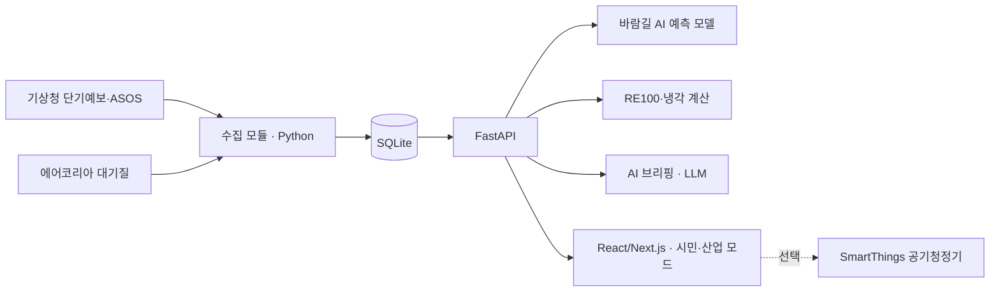

# Wave 바람길

> 바람 데이터로 잇는 우리 동네 공기 예보 × AI 데이터센터 RE100 시뮬레이터
>
> 2026 SCNU OSS·AI 해커톤 경진대회 고급 트랙 · 팀 Wave

- **상태**: 개발 중 (2026-09-22 주제·범위 확정, 9/23 기능 개발 착수)
- **서비스 주소**: <https://a8.scnuoss.net/> (9/26 배포 예정)
- **작업 목록**: [Issues](https://github.com/Willow33426/wave-windpath/issues)

## 한 줄 소개

같은 바람이 주민에게는 **공기가 오는 길**이고, 데이터센터에는 **전기와 냉각의 자원**입니다.
Wave 바람길은 기상 데이터 하나로 두 가지 질문에 답합니다.

| 모드 | 질문 | 대상 |
|---|---|---|
| 시민 모드 | 지금 우리 동네로 부는 바람은 어디에서 오나? 언제 환기·외출하면 좋은가? | 시설 인근 주민 |
| 산업 모드 | 이 후보지에 AI 데이터센터를 지으면 재생에너지로 전기를 얼마나 댈 수 있나? | 지자체·기업 유치 담당자 |

## 배경

- 전남은 AI 데이터센터(해남 등)와 RE100 반도체 국가산단(순천) 유치를 추진하고 있습니다.
- 기존 대기질 앱은 측정값과 지역 단위 예보 등급을 보여 줍니다. 특정 시설에서 우리 동네 쪽으로 바람이 부는 시간대는 알려 주지 않습니다.
- 재생에너지 매칭 시뮬레이터는 대부분 해외 기업용 도구라서 지역 주민과 지자체가 쓰기 어렵습니다.

## 주요 기능 (MVP 계획)

### 시민 모드

- AI 예측: 과거 대기질·풍향 자료로 학습한 모델이 기상 예보를 입력받아 향후 12시간 우리 동네 대기질 변화를 예측
- 바람길 표시: 시설(산단·발전소·데이터센터 부지)에서 우리 동네 쪽으로 바람이 부는 시간대를 표시
- 환기·외출 추천 시간
- AI 한 줄 브리핑 (LLM)
- (선택) 스마트홈 연동: 추천 결과에 따라 공기청정기를 자동 제어 (SmartThings API)

### 산업 모드

- 후보지와 시설 규모(MW) 입력
- 기상 관측 1년치(일사량·풍속·기온)로 태양광·풍력 발전량과 외기 냉각 가능 시간 추정
- 시간별 매칭으로 RE100 자급률, 부족 전력, 필요 설비 용량 계산
- 시설 → 주거지 방향 바람 빈도로 주민 영향 요약
- AI 브리핑: 지자체 보고용, 주민 설명용

## 데이터

| 데이터 | 제공처 | 용도 |
|---|---|---|
| 단기예보 (풍향·풍속·기온·강수) | 기상청 (공공데이터포털) | 시민 모드 예보, AI 예측 입력 |
| 종관기상관측(ASOS) 시간자료 (일사량·풍속·기온) | 기상청 | AI 예측 학습, 산업 모드 발전량·냉각 추정 |
| 대기오염정보 (실시간 측정값) | 한국환경공단 에어코리아 (공공데이터포털) | 시민 모드 현재 상태 |
| 대기오염 확정자료 (과거 시간별) | 한국환경공단 에어코리아 | AI 예측 학습 |
| 시설 위치 | 공개 자료 수기 입력 | 바람길 판정 기준점 |

계산·예측 결과는 의사결정을 돕는 추정치입니다. 특정 시설의 영향을 증명하지 않으며, 모델 오차와 가정을 화면에 공개합니다.

## 기술 구성



- 백엔드: Python, FastAPI
- 예측 모델: scikit-learn 계열. 학습은 로컬에서 하고 서버에는 모델 파일만 올려 추론만 합니다.
- 프론트엔드: React/Next.js. 빌드한 정적 파일을 FastAPI가 서빙해 포트 하나로 운영합니다.
- 배포: 대회 제공 서버, 팀 a8 (<https://a8.scnuoss.net/> → 내부 포트 3108). 사용자 권한 Supervisor와 crontab `@reboot`
- AI 코딩 도구: OpenAI Codex, Claude Code. 두 도구 모두 [AGENTS.md](AGENTS.md) 규칙을 따릅니다.

## 저장소 구조

```text
requirements.txt       # 앱 의존성
app/
  main.py              # FastAPI 앱 (현재 골격)
  .env.example         # 앱 실행 설정 예시
deploy/
  supervisord.conf     # 프로세스 운영 설정
  requirements.txt     # 앱 의존성 + Supervisor
  .env.example         # 서버 접속·배포 설정 예시
AGENTS.md              # 팀원과 AI 코딩 도구가 함께 따르는 작업 규칙
CLAUDE.md              # Claude Code용 안내 (AGENTS.md를 불러옴)
```

실제 설정은 `app/.env`와 `deploy/.env`에 두며 Git에 커밋하지 않습니다.

## 로컬 실행

프로젝트 루트에서 실행합니다.

```sh
python -m venv .venv
source .venv/bin/activate        # Windows: .venv\Scripts\activate
pip install -r requirements.txt
cp app/.env.example app/.env     # Windows: copy app\.env.example app\.env
python app/main.py
```

기본 주소는 <http://127.0.0.1:8000/> 입니다.

## 협업 규칙

- 작업은 Issue 단위로 나눕니다. `feature/기능명` 브랜치 → Pull Request → 1인 이상 리뷰 → 병합
- `main`에 직접 푸시하지 않습니다. PR 본문은 템플릿(무엇·왜·검증·영향)을 따릅니다.
- `.env`는 커밋하지 않습니다. API 키와 비밀번호는 채팅이나 AI 도구에 붙여 넣지 않습니다.

## 팀 Wave

| 이름 | 역할 |
|---|---|
| 류현우 (팀장) | PM, 데이터 수집, RE100·냉각 계산, 문서 |
| 문호영 | 바람길 AI 예측 모델, AI 브리핑(LLM) |
| 김현수 | 프론트엔드, UI/UX, 배포 |

## 일정

- 9/23 ~ 9/26: 개발
- 9/27 22:00: 결과물 제출
- 9/30: 발표·심사

## 출처와 라이선스

- 코드: [MIT](LICENSE)
- 배포 구조와 작업 규칙: 강사 예제 [charsyam/scnu-oss-advanced-track-example](https://github.com/charsyam/scnu-oss-advanced-track-example) (MIT)
- 데이터: 기상청, 한국환경공단(에어코리아). 공공데이터포털 이용 조건을 따르며, 데이터별 이용허락 범위는 최종 제출 때 기재합니다.
- 사용한 오픈소스 목록과 라이선스는 최종 제출 때 정리합니다.
