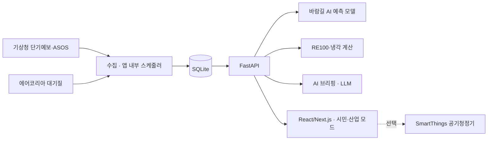

# Wave 바람길

> 바람 데이터로 잇는 우리 동네 공기 예보 × AI 데이터센터 RE100 시뮬레이터
>
> 2026 SCNU OSS·AI 해커톤 경진대회 고급 트랙 · 팀 Wave

- **상태**: 개발 중 (2026-09-22 주제·범위 확정, 9/23 기능 개발 착수)
- **서비스 주소**: <https://a8.scnuoss.net/> (9/26 배포 예정)
- **작업 목록**: [Issues](https://github.com/Willow33426/wave-windpath/issues)

## 한 줄 소개

같은 바람이 주민에게는 **공기가 오는 길**이고, 데이터센터에는 **전기와 냉각의 자원**입니다.
Wave 바람길은 기상 데이터 하나로 두 가지 질문에 답합니다.

| 모드 | 질문 | 대상 |
|---|---|---|
| 시민 모드 | 지금 우리 동네로 부는 바람은 어디에서 오나? 언제 환기·외출하면 좋은가? | 순천 등 광양만권 주민 |
| 산업 모드 | 이 후보지에 AI 데이터센터를 지으면 재생에너지로 전기를 얼마나 댈 수 있나? | 지자체·기업 유치 담당자 (해남 등 후보지) |

## 배경

- 순천은 광양제철소·광양국가산단·여수국가산단과 가깝습니다. 남풍이 불 때 산단 쪽 공기가 도심으로 올 수 있습니다.
- 전남은 AI 데이터센터(해남 등)와 RE100 반도체 국가산단(순천) 유치도 추진하고 있어 산업 시설이 더 늘어날 예정입니다.
- 기존 대기질 앱은 측정값과 지역 단위 예보 등급을 보여 줍니다. 특정 시설에서 우리 동네 쪽으로 바람이 부는 시간대는 알려 주지 않습니다.
- 재생에너지 매칭 시뮬레이터는 대부분 해외 기업용 도구라서 지역 주민과 지자체가 쓰기 어렵습니다.

## 주요 기능 (MVP 계획)

### 시민 모드 (순천)

- AI 예측: 바람이 불어오는 쪽 측정소(광양·여수)와 풍향으로 학습한 모델이 기상 예보를 입력받아 향후 12시간 순천 동네 대기질 변화를 예측
- 바람길 표시: 산단에서 우리 동네 쪽으로 바람이 부는 시간대를 표시
- 환기·외출 추천 시간
- AI 한 줄 브리핑 (LLM)
- (선택) 스마트홈 연동: 추천 결과에 따라 공기청정기를 자동 제어 (SmartThings API)

### 산업 모드 (해남 등 후보지)

- 후보지와 시설 규모(MW) 입력
- 기상 관측 1년치(일사량·풍속·기온)로 태양광·풍력 발전량과 외기 냉각 가능 시간 추정
- 시간별 매칭으로 RE100 자급률, 부족 전력, 필요 설비 용량 계산
- 시설 → 주거지 방향 바람 빈도로 주민 영향 요약
- AI 브리핑: 지자체 보고용, 주민 설명용

## 데이터

| 데이터 | 제공처 | 용도 |
|---|---|---|
| 단기예보 (풍향·풍속·기온·강수) | 기상청 (공공데이터포털) | 시민 모드 예보, AI 예측 입력 |
| 종관기상관측(ASOS) 시간자료 (일사량·풍속·기온) | 기상청 | AI 예측 학습, 산업 모드 발전량·냉각 추정 |
| 대기오염정보 (실시간 측정값, 순천·광양·여수 측정소) | 한국환경공단 에어코리아 (공공데이터포털) | 시민 모드 현재 상태 |
| 대기오염 확정자료 (과거 시간별) | 한국환경공단 에어코리아 | AI 예측 학습 |
| 시설 위치 | 공개 자료 수기 입력 | 바람길 판정 기준점 |

계산·예측 결과는 의사결정을 돕는 추정치입니다. 특정 시설의 영향을 증명하지 않으며, 모델 오차와 가정을 화면에 공개합니다.

## 기술 구성



- 백엔드: Python, FastAPI
- 예측 모델: scikit-learn 계열. 학습은 로컬에서 하고 서버에는 모델 파일만 올려 추론만 합니다.
- 프론트엔드: React/Next.js. 빌드한 정적 파일을 FastAPI가 서빙해 포트 하나로 운영합니다.
- 배포: 대회 제공 서버, 팀 a8 (<https://a8.scnuoss.net/> → 내부 포트 3108). 사용자 권한 Supervisor와 crontab `@reboot`
- AI 코딩 도구: OpenAI Codex, Claude Code. 두 도구 모두 [AGENTS.md](AGENTS.md) 규칙을 따릅니다.

### 서버 한도에 맞춘 설계

대회 서버는 팀별로 **메모리 1.2GB, 프로세스 2개**를 씁니다 (<https://app.scnuoss.net/> 기준).

- 프로세스는 Supervisor와 앱(uvicorn 워커 1개) 두 개만 둡니다.
- 데이터 수집은 별도 프로세스 대신 앱 안의 스케줄러로 돌립니다.
- LLM은 서버에서 돌리지 않고 외부 API로 호출합니다. 예측 모델은 가벼운 모델만 올립니다.

## 저장소 구조

```text
requirements.txt       # 앱 의존성
app/
  main.py              # FastAPI 앱 (현재 골격)
  .env.example         # 앱 실행 설정 예시
deploy/
  supervisord.conf     # 프로세스 운영 설정
  requirements.txt     # 앱 의존성 + Supervisor
  .env.example         # 서버 접속·배포 설정 예시
AGENTS.md              # 팀원과 AI 코딩 도구가 함께 따르는 작업 규칙
CLAUDE.md              # Claude Code용 안내 (AGENTS.md를 불러옴)
THIRD_PARTY_NOTICES.md # 가져다 쓴 오픈소스의 저작권·라이선스 고지
```

실제 설정은 `app/.env`와 `deploy/.env`에 두며 Git에 커밋하지 않습니다.

## 로컬 실행

내 컴퓨터에서 서버를 띄워 보는 방법입니다. 저장소 폴더에서 위부터 차례로 실행합니다.

**Windows (PowerShell)**

```powershell
python -m venv .venv                  # 가상환경 만들기 (처음 한 번)
.venv\Scripts\Activate.ps1            # 가상환경 켜기
pip install -r requirements.txt       # 필요한 패키지 설치
copy app\.env.example app\.env        # 설정 파일 만들기 (처음 한 번)
python app\main.py                    # 서버 실행
```

**macOS·Linux**

```sh
python3 -m venv .venv
source .venv/bin/activate
pip install -r requirements.txt
cp app/.env.example app/.env
python app/main.py
```

브라우저에서 <http://127.0.0.1:8000/> 을 엽니다. 끝낼 때는 터미널에서 `Ctrl+C`를 누릅니다.
PowerShell에서 `Activate.ps1` 실행이 막히면 `Set-ExecutionPolicy -Scope Process RemoteSigned`를 먼저 실행합니다 (현재 창에만 적용).

## 배포

예제 저장소의 배포 절차를 팀 a8 기준으로 옮겼습니다. 비밀번호는 명령행·로그·채팅에 남기지 않습니다.

### 1. 배포 설정 (로컬)

```sh
cp deploy/.env.example deploy/.env
```

| 변수 | 값 |
|---|---|
| `USER_ID`, `PASSWORD` | 팀 SSH 계정과 비밀번호 (팀 채널에서 개별 전달) |
| `HOST` | `app.scnuoss.net` |
| `DEPLOY_ADDRESS` | `https://a8.scnuoss.net/` |
| `WORK_PATH` | `/home/a8/html/` |
| `INTERNAL_HOST`, `INTERNAL_PORT` | `127.0.0.1`, `3108` |

`WORK_PATH` 아래에 최상위 `requirements.txt`와 `app/`, `deploy/` 구조를 그대로 전송합니다.
로컬 가상환경, 로그, `.git`, 실제 환경 파일은 전송하지 않습니다. `deploy/.env`는 서버에 복사하지 않습니다.
서버의 `app/.env`에는 `INTERNAL_HOST`, `INTERNAL_PORT`와 앱 실행에 필요한 키만 적습니다.

### 2. 서버에서 실행

서버의 프로젝트 루트(`/home/a8/html`)에서 실행합니다. systemd 설정은 바꾸지 않습니다.

```sh
python3 -m venv .venv
.venv/bin/pip install -r deploy/requirements.txt
mkdir -p deploy/.run
chmod 700 deploy/.run
chmod 600 app/.env
.venv/bin/supervisord -c deploy/supervisord.conf
```

코드를 바꾼 뒤에는 설정을 반영하고 앱을 재시작합니다.

```sh
.venv/bin/supervisorctl -c deploy/supervisord.conf reread
.venv/bin/supervisorctl -c deploy/supervisord.conf update
.venv/bin/supervisorctl -c deploy/supervisord.conf restart wave-windpath
.venv/bin/supervisorctl -c deploy/supervisord.conf status
```

상태가 `RUNNING`인지, `https://a8.scnuoss.net/`이 HTTP 200을 돌려주는지 확인합니다.
로그는 `tail -f deploy/.run/app.log`로 봅니다.

### 3. 재부팅 후 자동 실행

`crontab -e`에 아래 한 줄을 추가합니다. 같은 항목이 있으면 교체하고 다른 항목은 그대로 둡니다.

```cron
@reboot cd /home/a8/html && /home/a8/html/.venv/bin/supervisord -c /home/a8/html/deploy/supervisord.conf >> /home/a8/html/deploy/.run/boot.log 2>&1
```

## 보안

- 비밀 값은 `.env`에만 둡니다. 저장소에는 값이 빈 `.env.example`만 있습니다.
- GitHub 비밀 스캔·푸시 차단, Dependabot 취약점 알림을 켜 두었습니다.
- `main` 브랜치는 보호되어 PR과 리뷰 1인 없이는 병합되지 않습니다.
- 공유 서버이므로 `app/.env`는 600, 운영 폴더는 700 권한으로 둡니다.
- 세부 규칙은 [AGENTS.md](AGENTS.md)의 보안 절을 따릅니다.

## 협업 규칙

- 작업은 Issue 단위로 나눕니다. `feature/기능명` 브랜치 → Pull Request → 1인 이상 리뷰 → 병합
- `main`에 직접 푸시하지 않습니다. PR 본문은 템플릿(무엇·왜·검증·영향)을 따릅니다.
- `.env`는 커밋하지 않습니다. API 키와 비밀번호는 채팅이나 AI 도구에 붙여 넣지 않습니다.

## 팀 Wave

| 이름 | 역할 |
|---|---|
| 류현우 (팀장) | PM, 데이터 수집, RE100·냉각 계산, 문서 |
| 문호영 | 바람길 AI 예측 모델, AI 브리핑(LLM) |
| 김현수 | 프론트엔드, UI/UX, 배포 |

## 일정

- 9/23 ~ 9/26: 개발 (9/24 골격 먼저 배포)
- 9/27 22:00: 결과물 제출
- 9/30: 발표·심사

## 출처와 라이선스

- 코드: [MIT](LICENSE)
- 배포 구조, 배포 절차, 작업 규칙: 사전교육 3교시(서버 설정)에서 제공된 예제 [charsyam/scnu-oss-advanced-track-example](https://github.com/charsyam/scnu-oss-advanced-track-example) (MIT). 원본 저작권·라이선스 고지는 [THIRD_PARTY_NOTICES.md](THIRD_PARTY_NOTICES.md)에 있습니다.
- 데이터: 기상청, 한국환경공단(에어코리아). 공공데이터포털 이용 조건을 따르며, 데이터별 이용허락 범위는 최종 제출 때 기재합니다.
- 사용한 오픈소스 목록과 라이선스는 최종 제출 때 정리합니다.
