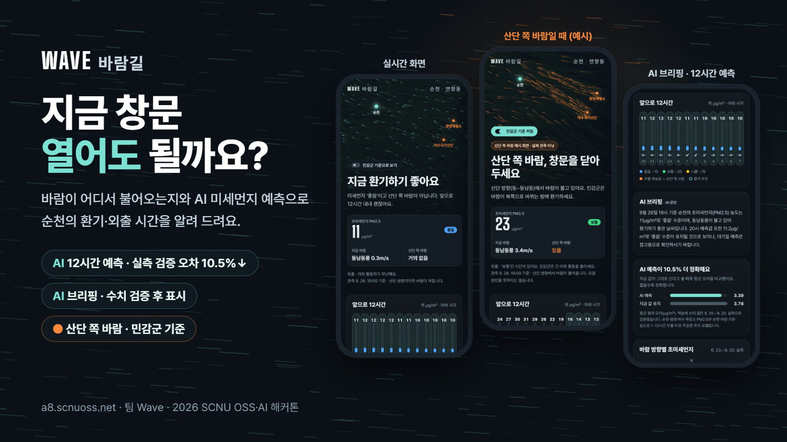
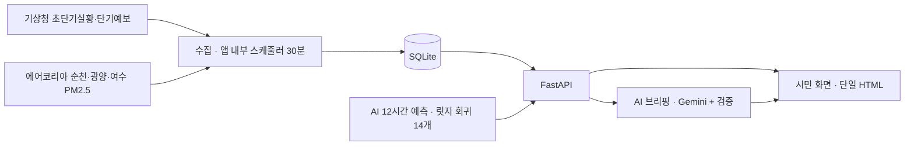

# Wave 바람길 개발보고서

2026 SCNU OSS·AI 해커톤 경진대회 고급 트랙 · 팀 Wave (류현우·문호영·김현수)

| 항목 | 내용 |
|---|---|
| 서비스 | <https://a8.scnuoss.net/> (휴대폰 화면 기준) |
| 저장소 | <https://github.com/Willow33426/wave-windpath> (공개, MIT) |
| 개발 기간 | 2026-09-22 ~ 09-27 |
| 한 줄 소개 | 바람이 어디서 불어오는지와 AI 미세먼지 예측으로 순천의 환기·외출 시간을 알려 주는 모바일 웹 |

## 1. 평가 필수 항목과 근거

| 항목 | 한 일 | 근거 |
|---|---|---|
| 설계 | API 명세를 먼저 합의하고, 팀 서버 한도(프로세스 2개·1.2GB)에 맞춰 구조를 정함 | [API 명세](api.md), 이 문서 2장 |
| AI 기능 | 90일 실측으로 학습한 12시간 예측 모델 + Gemini AI 브리핑(수치 검증 후 표시) | [모델 문서](model-ai.md), `app/forecast/ridge.py`, `app/briefing.py` |
| 협업 | Issue → 브랜치 → PR → 팀원 리뷰 → 병합. `main` 직접 푸시 금지 | [Pull requests](https://github.com/Willow33426/wave-windpath/pulls?q=is%3Apr), 이 문서 5장 |
| 서버 배포 | 팀 a8 서버에서 상시 운영. 한 줄 배포 스크립트 | [README 배포](../README.md#배포), `deploy/deploy.sh` |
| 안정성 | 외부 API 장애 시 대체 자료, 앱 강제 종료 후 자동 재시작을 PR마다 CI에서 검사 | `.github/workflows/tests.yml`, 이 문서 6장 |
| 문서화 | README(소개·실행·배포·보안·출처), API·모델·데이터 문서, 작업 규칙 | [README](../README.md), `docs/`, [AGENTS.md](../AGENTS.md) |
| 보안 | 비밀 값 서버 보관, 웹 루트 노출 차단, SQL 바인딩, 출력 검증, 호출 제한 | 이 문서 7장 |
| 최종 제출 | 갤러리 등록, 실행 URL, 공개 저장소, 발표자료, 시연영상, 이 보고서 | 이 문서 9장 |

## 2. 문제와 설계

### 해결하려는 문제

- 순천은 광양제철소(동 101°)·여수국가산단(동남동 117°)과 가깝습니다. 2019년에는 여수산단 업체들이 대기오염 측정기록을 조작한 사실이 적발되기도 했습니다.
- 공식 대기질 예보는 권역 단위·하루 평균 등급이라 "우리 동네에서 몇 시에 창문을 열지", "지금 산단 쪽에서 바람이 부는지"는 알 수 없습니다.
- Wave 바람길은 공공 측정값과 바람으로 1시간 단위 12시간 예측과 환기 추천 시간을 보여 주고, 예측 오차와 한계를 함께 공개합니다. 특정 시설을 오염 원인으로 단정하지 않습니다.

### 구조

| 경로 | 역할 |
|---|---|
| `GET /api/citizen/forecast` | 현재 상태, 12시간 예측, 환기·외출 권고, 바람 방향별 근거, 자료 출처 |
| `GET /api/citizen/briefing` | 같은 예보를 2~3문장으로 설명. AI 문장 또는 기본 안내 |
| `GET /api/health` | DB 상태와 마지막 수집 시각 |

### 설계 결정

- **API 명세 먼저**: 시민 화면 응답 형식과 예시 JSON을 먼저 합의(#1, #14)해서 화면과 서버를 나눠 만들 수 있게 했습니다.
- **서버 한도**: 팀별 프로세스 2개·메모리 1.2GB라서 Supervisor와 앱(uvicorn 워커 1개) 두 개만 둡니다. 수집은 별도 프로세스 대신 앱 안의 스케줄러가 30분마다 하고, LLM은 외부 API로 부릅니다.
- **가벼운 AI**: 예측 모델은 외부 패키지 없이 순수 파이썬으로 추론하고, 서버는 계수 파일(12KB)만 읽습니다.
- **단일 HTML 화면**: 빌드 도구 없이 HTML·CSS·JS 한 파일. 대회 서버 Nginx가 첫 화면을 바로 제공하고 `/api/`만 앱으로 넘깁니다. 첫 화면은 실제 풍향으로 흐르는 바람 입자와 산단 방위를 그린 캔버스입니다.
- **지역 선택**: 순천은 바람 상류에 광양·여수 측정소가 있어, 이웃 측정소 변화를 예측 입력으로 쓸 수 있습니다.

## 3. AI 기능

### 12시간 초미세먼지 예측

| 항목 | 내용 |
|---|---|
| 모델 | 예측 시간(1~14시간 뒤)마다 따로 학습한 릿지 회귀 14개 |
| 입력 | 순천 PM2.5(현재·과거·평균), 광양·여수 PM2.5와 변화량, 순천 풍향·풍속·기온·습도, 산단 방향 바람×풍속, 시각 |
| 학습 자료 | 2026-06-23 ~ 09-20 시간별 2,160행(에어코리아 실측 + Open-Meteo 과거 기상) |
| 검증 | 시간순으로 자르고 학습에 쓰지 않은 뒷부분만 채점 |

| 검증 기간 | AI(릿지) | 지금 값 유지 | 개선 |
|---|---:|---:|---:|
| 08-25 ~ 09-20 (뒤 30%) | **3.39** | 3.78 | 10.5% |
| 09-03 ~ 09-20 (뒤 20%) | **3.14** | 3.62 | 13.3% |

평균 절대 오차(㎍/㎥). 1~12시간 모든 구간에서 '지금 값 유지'보다 정확하고, 12시간 뒤 차이가 가장 큽니다(3.84 vs 4.29).
그래디언트 부스팅(문호영 실험, [기록](experiments/model-hgb.md))을 포함한 네 가지를 같은 조건에서 비교해 가장 정확한 릿지 회귀를 채택했습니다.
입력이 모자라면 기준선 예측으로 자동 전환하고 화면에 예측 방식을 표시합니다.

### AI 브리핑

- 예측 수치로 만든 기본 문장을 Gemini(`gemini-3.1-flash-lite`)가 2~3문장으로 다듬습니다.
- LLM이 수치를 바꾸거나 원인을 단정하지 못하게 **표시 전에 검증**합니다: 관측·예측 수치와 시각·등급·풍향이 입력과 같은지, 입력에 없는 숫자가 없는지, '예측'·'참고' 표시가 있는지 확인합니다. 확정 표현, 원인 표현(원인·배출 등), 시설명(산단·산업단지 등), HTML·링크가 있으면 버립니다.
- 검증에 실패하거나 키가 없거나, 시간 초과(최대 8초)·호출 한도(분당 10회)에 걸리면 기본 안내를 보여 줍니다. 결과는 수집 시각별로 5분 캐시합니다.
- 화면에는 출처를 'AI 문장' 또는 '기본 안내'로 표시합니다. 검증 규칙의 우회 사례는 리뷰에서 찾아 회귀 테스트로 남겼습니다(#27).

## 4. 화면과 사용 흐름

1. 첫 화면: 한 줄 결론("지금 환기하기 좋아요" 등), 현재 초미세먼지·바람, 산단 쪽 바람 여부
2. 앞으로 12시간: 시간별 예측과 풍향, 환기 추천 시간(민트 테두리)
3. AI 브리핑: 관측과 예측을 구분한 2~3문장
4. 민감군 기준 토글: 아이·어르신·호흡기 질환이면 권고를 한 단계 조심스럽게(예: 산단 쪽 바람이면 창문 닫기). 선택은 기기에 저장
5. 근거: AI 정확도, 90일 바람 방향별 초미세먼지 평균(산단 방향 12.0 vs 그 밖 10.9, 가장 높은 건 북풍 14.6), 자료와 한계

`?debug=1`로 산단 쪽 바람·대체 자료·오류 상태를 예시로 볼 수 있고, 예시 화면에는 "실제 관측 아님"을 표시합니다.

## 5. 협업

- 작업을 Issue로 나누고 `feature/…`·`fix/…` 브랜치에서 PR로 올립니다. `main`은 보호되어 팀원 1인 승인 없이는 병합되지 않고(관리자 포함), 모든 PR에서 CI가 돌아 통과를 확인한 뒤 병합합니다.
- PR 본문은 무엇·왜·검증·영향 형식을 따르고, 리뷰 지적은 후속 커밋이나 후속 PR로 반영합니다.
- 팀원과 AI 코딩 도구(OpenAI Codex, Claude Code)가 같은 [작업 규칙](../AGENTS.md)을 따릅니다. Codex로 PR을 교차 리뷰해 지적(P1·P2)을 반영했습니다.

| 팀원 | 맡은 일 | 주요 PR |
|---|---|---|
| 류현우(팀장) | 기획·PM, 공공데이터 수집·API, AI 예측 모델, 화면 통합·개편, 배포·보안, 문서 | #14 #15 #16 #17 #18 #20 #21 #22 #26 #27 |
| 문호영 | 부스팅 모델 실험·에어코리아 이력 추출 도구, AI 브리핑(Gemini·템플릿 폴백), 리뷰 | #23 #24 |
| 김현수 | 시민 화면 UI 초안·API 상태 화면과 테스트(#20에 통합), 링크 미리보기, 리뷰 | #19 #25 |

리뷰에서 실제 결함을 잡아 고친 예:

- #20 리뷰(문호영): 실데이터 수집 중에도 옛 예시 PM2.5가 현재값에 섞이는 문제 → 수정 후 회귀 테스트
- #27 리뷰(문호영): 템플릿에 '산단'이 있으면 "산단이 초미세먼지를 만들어내므로…"가 AI 문장 검증을 통과 → 시설명은 항상 기본 안내로 대신 표시

## 6. 서버 배포와 안정성

### 배포

- 대회 서버 팀 a8: Nginx가 `/home/a8/html/`의 `index.html`을 제공하고 `/api/`를 내부 포트 3108의 FastAPI로 넘깁니다.
- 사용자 권한 Supervisor로 앱을 띄우고(systemd 미사용), crontab `@reboot`로 서버 재부팅 후에도 Supervisor가 다시 뜨게 했습니다.
- `git pull --ff-only origin main && sh deploy/deploy.sh` 한 줄로 의존성 설치, 재시작, 첫 화면 복사, 운영 폴더 권한 설정, 상태 확인까지 합니다.

### 장애 대응

| 상황 | 동작 |
|---|---|
| 공공 API 오류·빈 응답 | 수집 실패로 기록하고 대체 자료로 계속 응답. 화면에 대체 자료임을 표시 |
| 예측 입력 부족 | 기준선 예측(지금 값 유지·풍향 규칙)으로 자동 전환 |
| LLM 오류·시간 초과·한도 소진·검증 실패 | 기본 안내 문장으로 응답(HTTP 200) |
| 앱 프로세스 종료 | Supervisor가 자동 재시작(`autorestart`) |
| 잦은 요청 | 예보 1분·브리핑 5분 캐시, LLM 분당 10회 제한 |

### 테스트와 CI

PR마다 GitHub Actions가 세 가지를 검사합니다.

1. 단위 테스트: 구문 검사와 설치 없이 도는 테스트
2. 앱 기동 확인: 의존성 설치 후 FastAPI 포함 전체 테스트(9/26 기준 98개)
3. 배포 리허설: 서버와 같은 방식으로 설치해 Supervisor로 기동하고 응답을 확인한 뒤, 앱을 `kill -9`로 죽여 자동으로 다시 뜨는지 확인

공유 서버라 실제 서버 재부팅 시험은 하지 않았습니다. 재부팅 때 실행되는 명령은 배포 리허설과 같습니다.

## 7. 보안

| 점검 항목(교육 보안 체크리스트) | 조치 |
|---|---|
| 비밀 값 | API 키는 서버 `app/.env`(권한 600)에만 둡니다. 저장소에는 빈 `.env.example`만 있습니다. GitHub 비밀 스캔·푸시 차단을 켰습니다 |
| 프로젝트 전체 공개 금지 | 웹 루트가 프로젝트 폴더라 `.git`·DB가 내려받아지던 문제를 9/26에 찾아, 배포 스크립트가 운영 폴더를 700으로 막게 했습니다. `/.git/HEAD`·`/data/wave.db`·`/app/.env` 모두 404 확인 |
| 최소 권한 | root·systemd 없이 팀 계정 권한 Supervisor로만 실행 |
| SQL 주입 | 모든 쿼리를 `?` 바인딩으로 실행 |
| 출력·XSS | 화면에 넣는 값은 이스케이프하고, LLM 문장은 `textContent`로 표시. `<`·`>`·링크가 든 LLM 답은 버림 |
| 입력 검증 | 지역은 순천만, 시간은 1~24로 제한(범위 밖 400·422) |
| 외부 API 키 전달 | LLM 키는 요청 헤더로만 보내고, 응답·예외 본문은 로그에 남기지 않음 |
| 의존성·브랜치 | Dependabot 취약점 알림, `main` 보호(팀원 승인 필수·관리자 포함, 강제 푸시 금지) |

## 8. 한계와 다음 단계

- 여름 90일 자료로만 학습해 겨울·봄 고농도 계절 성능은 아직 검증하지 않았습니다. 수집이 계속 쌓이므로 `scripts/train_ridge.py`로 다시 학습합니다.
- 바람 방향별 평균은 단순 비교라 인과를 뜻하지 않습니다. 화면에도 그렇게 적었습니다.
- 다음 계획: 산업 모드(해남 등 AI 데이터센터 후보지의 RE100 자급률·외기 냉각, #5), SmartThings 공기청정기 연동(#7)

## 9. 최종 제출물

| 제출물 | 위치 |
|---|---|
| 갤러리 프로젝트 페이지 | <https://gallery.scnuoss.net/> |
| 실행 URL | <https://a8.scnuoss.net/> |
| GitHub 저장소 | <https://github.com/Willow33426/wave-windpath> |
| 발표자료·시연영상 | 갤러리 프로젝트 페이지에 링크 |
| 개발보고서 | 이 문서 |
